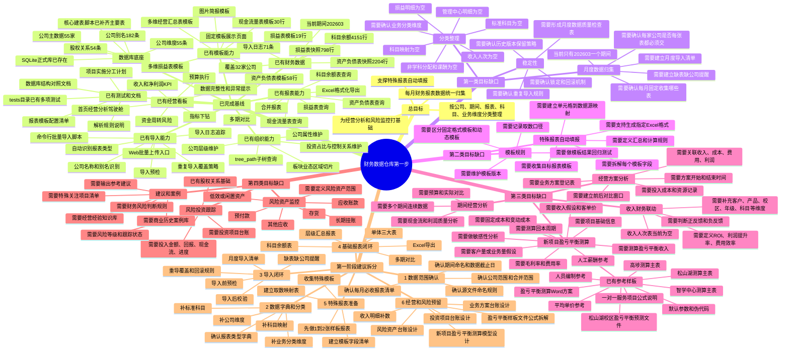

# 财务数据仓库第一步工作拆分思维导图

记录日期：2026-06-09

用途：把现有系统进度、已完成能力、待确认缺口和第一步工作拆分放到一张图里，方便后续逐项补充、确认和推进。

## 当前基线摘要

- 当前数据库：`data/finance_dw.db`
- 公司主数据：55 家
- 公司维度：55 条
- 公司别名：182 条
- 股权关系：54 条
- 科目余额：4151 行，覆盖 32 家公司
- 资产负债表导入快照：2204 行
- 损益表导入快照：798 行
- 当前期间：202603
- 导入日志：71 条
- 已导入类型：`account_balance` 32 条、`balance_sheet` 38 条、`income_statement` 1 条
- 报表模板：资产负债表 58 行、损益表 19 行、现金流量表 30 行
- 预算数据：年度预算目标 62 条、预算实际补录 410 条
- 暂为空表：标准科目、科目映射、损益明细、收入人次、管理中心明细、非学科分配、非学科课酬等

## 思维导图

## 需要你补充确认的问题

1. 每月必须收集的报表到底是哪几类，是否仍按 10 类报表执行。
2. 当前第一阶段要覆盖哪些公司，是全部 55 家，还是先选一批重点公司。
3. 202603 是否是试运行月份，后续是否要导入 202604、202605 等连续月份。
4. 标准科目和科目映射是否已有 Excel 或历史资料可以导入。
5. 第二类“特殊数据报表”中，最优先要自动生成的是哪一张或哪几张模板。
6. 收入明细数据目前来自哪里，是收入人次表、业务系统导出，还是手工 Excel。
7. 风险资产和风险投资目前是否已有台账，还是需要从零设计台账结构。
8. 新项目盈亏平衡测算优先覆盖哪类项目，例如新校区、新产品线、新投资项目、专项营销方案或其他业务方案。

## 下一步建议

先围绕“第一类目标：每月财务报表数据归集与分类”推进，不急着直接做复杂经营推断和风险建议。

第一步建议形成三个交付物：

- 月度数据收集清单
- 数据字典和分类规则
- 当前数据库已完成与待补齐对照表

你补充完业务口径后，再把这些内容转成具体开发任务。
